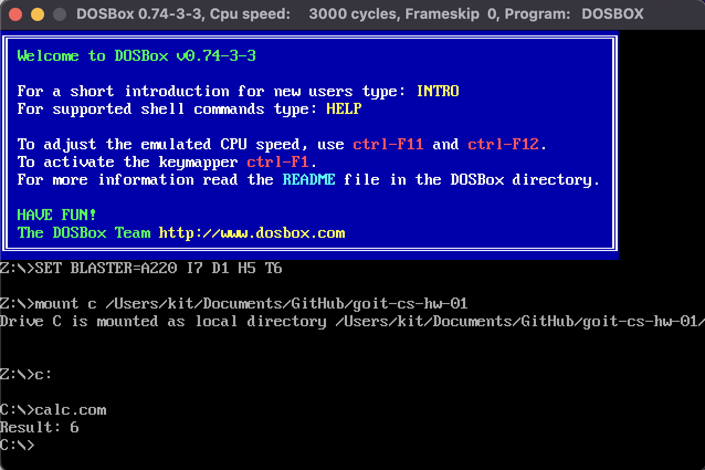

[Nasm](https://www.nasm.us/)
[DosBox Emulator](https://www.dosbox.com/)

В терміналі перейдіть до директорії з файлом calc.asm за допомогою команди cd та виконайте компіляцію файлу calc.asm, використовуючи NASM:

`nasm -f bin -o calc.com calc.asm`

Для DOSBox необхідно знову виконати змонтування директорії, де зберігається calc.com як віртуальний диск у DOSBox.

`mount c f:\\asm`

Перейдіть до змонтованого диска:

`c:`

І запустіть програму обчислення арифметичного виразу

`calc.com`

